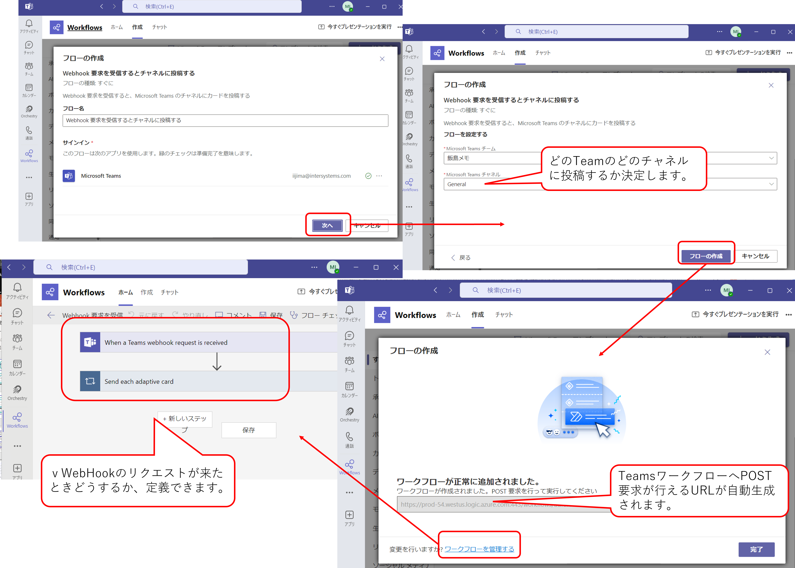

# Teams チャネルにメッセージを IRIS から送信する

curl コマンドや REST クライアントを利用して Teams チャネルに任意メッセージを簡単に送信できるので、IRIS の Interoperability を使って自動的に何か情報を入手＋必要なときだけ Teams チャネル通知ができたら面白いな、と思い試してみた内容をご紹介します。

以下、Teamsワークフローの作成例です



Teamsワークフローの仕様に合わせたメッセージ用JSONが用意できれば、こんなメッセージを出すことができます。


> Teams チャネルにメッセージを通知するには「Teams ワークフローの Webhook」の用意が必要です。（この用意によってアクセスするために必要なURLが生成されます）詳しくは、「[Microsoft Teamsのワークフローを使用して受信 Webhook を作成する](https://support.microsoft.com/ja-jp/office/create-incoming-webhooks-with-workflows-for-microsoft-teams-8ae491c7-0394-4861-ba59-055e33f75498)」をご参照ください。

> 通知までの設定などについては、こちらのページを参考にさせていただきました：[Teams チャネルへメッセージ送信する方法](https://kinoshita-hidetoshi.github.io/Programing-Items/Etc/Bash/send_message_to_teams_with_webhook.html#1._Microsoft_Teams_%E3%83%81%E3%83%A3%E3%83%8D%E3%83%AB%E3%81%AE%E3%83%9D%E3%82%B9%E3%83%88_Webhook_URL_%E3%82%92%E7%94%9F%E6%88%90%E3%81%99%E3%82%8B)

以下、試した順でご紹介します。


[1. curl コマンドでまずは実行してみる](#1-curl-コマンドでまずは実行してみる)

[2. シンプルにターミナルから試す](#2-シンプルにターミナルから試す)

[3. 通知メッセージのJSONを変えてみる](#3-通知メッセージのjsonを変えてみる)

[4. メッセージのJSONをJSONテンプレートエンジンで作ってみる](#4-メッセージのjsonをjsonテンプレートエンジンで作ってみる)

[5. Web ページを定期的にチェックし、新着情報のみ通知してみる](#5-web-ページを定期的にチェックし新着情報のみ通知してみる)

[6. 試し方](#6-試し方)


## 1. curl コマンドでまずは実行してみる

例文の「URL」にTeamsワークフローで生成されたURLが設定されているとします。

POSTで送信するボディの中身は [simple.json](/data/simple.json) を指定しています。
<details><summary> simple.json </summary>

```
{
    "type":"message",
    "attachments":[
        {
            "contentType":"application/vnd.microsoft.card.adaptive",
            "contentUrl":null,
            "content": {
            "$schema":"http://adaptivecards.io/schemas/adaptive-card.json",
            "type":"AdaptiveCard",
            "version":"1.4",
            "body":[
                {
                    "type": "TextBlock",
                    "text":"こんにちは！"
                }
            ]
        }
        }
    ]
}
```
</details>


```
curl -X POST -H "Content-Type: application/json" --data-binary @/home/isjedu/container/TeamsWorkFlow/data/simple.json $U
RL
```

この結果として、以下のメッセージが通知されます。


## 2. シンプルにターミナルから試す

[%Net.HttpRequest クラス](https://docs.intersystems.com/irisforhealthlatest/csp/documatic/%25CSP.Documatic.cls?LIBRARY=%25SYS&CLASSNAME=%25Net.HttpRequest)を利用してターミナルから実行することもできます。

注意点としては、Teams ワークフローで作成されるURLはリクエストするサーバ、パス、クエリ文字列を含んだ URL で生成されます。

クエリ文字列にエスケープ文字（例：%2F　など）が含まれる場合がありますのでターミナル送信時はエスケープ文字を元の文字に戻して送付する必要がありました。

コード詳細は以下のページをご参照ください。

ObjectScriptクックブックに記載の「[HTTPのPOST要求を実行したい](https://github.com/Intersystems-jp/ObjectScriptCookBook/blob/master/CookBook.md#http%E3%81%AEpost%E8%A6%81%E6%B1%82%E3%82%92%E5%AE%9F%E8%A1%8C%E3%81%97%E3%81%9F%E3%81%84)」の2つ目の例文


## 3. 通知メッセージのJSONを変えてみる

Teamsに送信するメッセージをもっと見栄え良いものに加工することもでき、[Adaptive Card デザイナー](https://adaptivecards.io/designer/)を使って簡単に作成できるようでした。

ということで、以下のイメージとなるようなJSONを組み立ててみました。


> 「あいうえお」の下にある太字部分はリンクになっていて、対象のニュースページを開くように作られています
<details><summary>上記メッセージの元になるJSON</summary>

```
{
    "type":"application/json",
    "attachments":[
      {
        "contentType":"object",
        "content":{
          "type":"AdaptiveCard",
          "version":"1.4",
          "msTeams":{
            "width":"full"
          },
          "body":[
            {
              "type":"Image",
              "url":"https://avatars.githubusercontent.com/u/67250170?s=200&v=4",
              "altText":"コミュニティロゴ",
              "width":"-7px",
              "size":"Medium"
            },
            {
              "type":"TextBlock",
              "text":"新着記事のお知らせ！",
              "wrap":true,
              "fontType":"Default",
              "size":"Large",
              "weight":"Bolder",
              "color":"Attention",
              "isSubtle":true
            },
            {
              "type":"TextBlock",
              "text":"あいうえお",
              "wrap":true
            },
            {
              "type":"ActionSet",
              "actions":[
                {
                  "type":"Action.OpenUrl",
                  "title":"地震メカニズムなど研究へ 国内2位のスパコン東大に設置 千葉",
                  "url":"http://www3.nhk.or.jp/news/html/20250115/k10014694041000.html"
                },
                {
                  "type":"Action.OpenUrl",
                  "title":"月面着陸へ再挑戦 打ち上げ成功 都内ベンチャー企業",
                  "url":"http://www3.nhk.or.jp/news/html/20250115/k10014693981000.html"
                }
              ]
            }
          ]
        }
      }
    ]
  }
```
</details>

新着情報が増えた場合、リンク表示の部分が繰り返されるだけなので作成は簡単ですが、JSONの階層を辿り、値を設定していくのは少し面倒な気がします（特にカードのデザインを変えたい場合など修正が面倒そうです）。

## 4. メッセージのJSONをJSONテンプレートエンジンで作ってみる

ということで、JSONテンプレートエンジンを使ってJSONを生成してみます。

> JSONテンプレートエンジンは、階層が深い複雑なJSON文字列の生成を簡単に行えるクラスで、作成したいJSON文字列のテンプレートの指定と、動的に値が変わる部分への値の挿入がとても簡単にできるクラスです。

JSONテンプレートエンジンについて詳しくは、ウェビナービデオか、利用例を含めた記事をご参照ください。

- [JSONテンプレートエンジンのご紹介](https://www.youtube.com/watch?v=H4LzOV-Tfzg&list=PLzSN_5VbNaxB39_H2QMMEG_EsNEFc0ASz)

    ウェビナーでは複雑なJSONの例として、医療情報交換標準規格の HL7 FHIR の例でご紹介していますが、一般的なJSON文字にも対応しています。（例として以下の記事を掲載しています。併せてご参照ください。）

- [複雑なJSONの生成に便利な「JSONテンプレートエンジン」の使い方ご紹介](https://jp.community.intersystems.com/node/551396)


Teamsメッセージに使用するJSONで値を繰り返し設定したい場所は、以下の title と urlです。

```
"actions":[
    {
        "type":"Action.OpenUrl",
        "title":"地震メカニズムなど研究へ 国内2位のスパコン東大に設置 千葉",
        "url":"http://www3.nhk.or.jp/news/html/20250115/k10014694041000.html"
    },
    {
        "type":"Action.OpenUrl",
        "title":"月面着陸へ再挑戦 打ち上げ成功 都内ベンチャー企業",
        "url":"http://www3.nhk.or.jp/news/html/20250115/k10014693981000.html"
    }
]
```
それ以外のJSONは、だいたい固定値でよさそうなので、titleとurlを動的に置き換えできるよう、[JSONTemplate.Base](/src/JSONTemplate/Base.cls)を継承するクラスを定義します。

[Test.AdaptiveCardActionsクラス](/src/Test/AdaptiveCardActions.cls)では、上記 JSON の actions 配列に含まれる JSON オブジェクトの部分のみを定義しています。
```
Class Test.AdaptiveCardActions Extends JSONTemplate.Base
{

Property ActionTitle As %String(MAXLEN = 100);

Property ActionUrl As %String(MAXLEN = 500);

XData Template [ MimeType = application/json ]
{
{
        "type": "Action.OpenUrl",
        "title": "#(..ActionTitle)#",
        "url": "#(..ActionUrl)#"
    }
}

}
```

Adaptive Card全体のJSONも作成する必要があるので、[Test.AdaptiveCardActionsクラス](/src/Test/AdaptiveCardActions.cls) で生成されるJSONを複数埋め込むためのクラス：[Test.AdaptiveCardクラス](/src/Test/AdaptveCard.cls)を以下のように用意します。（このクラスも[JSONTemplate.Base](/src/JSONTemplate/Base.cls)を継承する必要があります）

```
Class Test.AdaptveCard Extends JSONTemplate.Base
{

Property Message As %String(MAXLEN = 500);

Property Actions As list Of Test.AdaptiveCardActions;

XData Template [ MimeType = application/json ]
{
{
    "type": "application/json",
    "attachments": [
        {
            "contentType": "object",
            "content": {
                "type": "AdaptiveCard",
                "version": "1.4",
                "msTeams": {
                    "width": "full"
                },
                "body": [
                    {
                        "type": "Image",
                        "url": "https://avatars.githubusercontent.com/u/67250170?s=200&v=4",
                        "altText": "コミュニティロゴ",
                        "width": "-7px",
                        "size": "Medium"
                    },
                    {
                        "type": "TextBlock",
                        "text": "RSS News!",
                        "wrap": true,
                        "fontType": "Default",
                        "size": "Large",
                        "weight": "Bolder",
                        "color": "Attention",
                        "isSubtle": true
                    },
                    {
                        "type": "TextBlock",
                        "text": "#(..Message)#",
                        "wrap": true
                    },
                    {
                        "type": "ActionSet",
                        "actions":["#(..Actions)#"]
                    }
                ]
            }
        }
    ]
}
}

}

```
JSONの actions に注目すると以下のように定義されています。

```
"actions":["#(..Actions)#"]
```
**#(..プロパティ名)#** の定義は、プロパティに設定した値がこの場所に当てはめられることを意味しています。

**Actionsプロパティ** の定義は以下の通りです（リストコレクションで複数の情報を登録できるように定義しています）。

```
Property Actions As list Of Test.AdaptiveCardActions;
```

まずはターミナルでJSON文字列の生成をテストします。

```
// actions:[]　に含めるJSON文字列用の設定
set actions1=##class(Test.AdaptiveCardActions).%New()
set actions1.ActionTitle="テストタイトル"
set actions1.ActionUrl="http://localhost/csp/sys/UtilHome.csp"
set actions2=##class(Test.AdaptiveCardActions).%New()
set actions2.ActionTitle="開発者コミュニティ"
set actions2.ActionUrl="https://jp.community.intersystems.com/"

// AdaptiveCardのJSON文字列用設定
set card=##class(Test.AdaptiveCard).%New()
set card.Message="これはテストです"
do card.Actions.Insert(actions1)
do card.Actions.Insert(actions2)
do card.OutputToDevice() // JSON文字をカレントデバイスに出力
```

これで目的のJSON（例：[test.json](/data/test.json)）を簡単に作成できそうです。

## 5. Web ページを定期的にチェックし、新着情報のみ通知してみる

IRIS Interoperability のプロダクションを利用して、Webページを定期的にチェック（GET）しようと思ったとき、実はすぐに使えるインバウンドアダプタがありません。

特定のWebページの情報を定期的にGETしたい場合は、%Net.HttpRequestクラスを利用して、カスタムインバウンドアダプタを作ることになります。

> ブラウザで試せるチュートリアルの中の「[IRIS の Interoperability（相互運用性）を試せるチュートリアル](https://jp.community.intersystems.com/node/538781)」の中で実は使用しています。サンプルコードはこちら👉[dc.Reddit.InboundAdapter](https://github.com/intersystems-community/iris-interoperability-template/blob/master/src/dc/Reddit/InboundAdapter.cls)

今回は定期的にNHKの最新ニュースを入手してみようと思い [NHKのRSS](https://www.nhk.or.jp/toppage/rss/index.html)を利用することにしました。

> RSSはちょっと古いですが、GET後の処理がしやすいページでしたので選択しました。

%Net.HttpRequest クラスを利用する方法でも定期的なGETはできますが、Python の ライブラリ：[feedparser](https://pypi.org/project/feedparser/) 利用することで、より簡単に必要な情報が入手できましたので、インバウンドアダプタの処理を Python で記述してみました。

NHK RSSの[主要ニュース](https://www.nhk.or.jp/rss/news/cat0.xml)を[feedparser](https://pypi.org/project/feedparser/)で読み取ると、\<items>の情報が Python listで受け取れます（list["entries"]に設定されます）。

受け取った list の中身をそのままプロダクションで利用したいので、IRIS内にプロダクションで使用するメッセージクラスを用意し、[feedparser](https://pypi.org/project/feedparser/)で得られた list の中身を直接インバウンドアダプタの処理内でメッセージクラスにセットし、作成したメッセージをアダプタからビジネス・サービスに渡す方法で作ってみました。

RSSで取り出せる情報（左）と作成したメッセージクラス（右）のイメージは以下の通りです。


[feedparser](https://pypi.org/project/feedparser/)でパースし、メッセージクラスに格納するコードは以下メソッドで定義しています。

```
ClassMethod RSSParse(url As %String(MAXLEN=200)) As Test.RSSMessageBatch [ Language = python ]
{
import iris
import feedparser
import json
from datetime import datetime, timedelta, timezone
tz = timezone(timedelta(hours=+9), 'Asia/Tokyo')

rssfeed=feedparser.parse(url)

#サービスに送るメッセージクラスのインスタンス生成
batch=iris.cls("Test.RSSMessageBatch")._New()
#entries 以下にRSSの<channel>以下の<items>の情報がlistで取得できる。
#published_parsedを使ってYYYY-MM-DD HH:MM:SSの形式に変換しておく(JSTで)
for data in rssfeed["entries"]:
    pubparsedate=data["published_parsed"]
    pubparsedateLocal=datetime(*pubparsedate[:6],tzinfo=timezone.utc).astimezone(tz)
    dispdate=pubparsedateLocal.strftime('%Y-%m-%d %H:%M:%S')

    #バッチクラスに含めるメッセージクラスのインスタンス生成
    msg=iris.cls("Test.RSSMessage")._New()
    msg.Title=data["title"]
    msg.PublishedDate=dispdate
    msg.URL=data["link"]
    #バッチクラスに登録
    batch.Messages.Insert(msg)
return batch
}
```


カスタムアダプタクラス全体：[Test.InboundAdapter](/src/Test/InboundAdapter.cls)


プロダクション全体図は以下の通りです。

 

> **※** のマークがあるところは、[feedparser](https://pypi.org/project/feedparser/)でパースした情報が含まれる IRIS のメッセージクラスを利用しています。

インバウンドアダプタ用クラスの OnTask() では一定間隔ごとに実行したい処理を記載できますので、上記メソッド（RSSParse()）を呼び出し、入手した情報（＝IRISのメッセージクラスのインスタンス）をビジネス・サービスのProcessInput()に渡しています。

```
/// default InboundAdapter behavior: always call ProcessInput on CallInterval
Method OnTask() As %Status
{
    set status=$$$OK
    try {
        #dim batchmessage As Test.RSSMessageBatch
        set batchmessage=..RSSParse(..RSS)
        $$$ThrowOnError(..BusinessHost.ProcessInput(batchmessage))
    }
    catch ex {
        set status=ex.AsStatus()
    }
    Set ..BusinessHost.%WaitForNextCallInterval=1
    return status
}
```
残りは、通常のプロダクションの開発と一緒です。

サービスの次に呼び出すプロセスでは、既に通知した情報であるかどうかをチェックし、オペレーションには、未通知の情報のみが渡るように調整しています。


Teamsの通知に使うオペレーションは、HTTPアウトバウンドアダプタを利用しています。

オペレーション内では、Teamsに送信するJSON文字列を [JSONテンプレートエンジン](#4-メッセージのjsonをjsonテンプレートエンジンで作ってみる)を利用して作成し、POST要求送信しています。

Teamsへの通知ですが、ボディの情報とクエリパラメータの両方を送付する必要があります。

HTTPアウトバウンドアダプタが提供してくれるメソッドではこの両方を渡せるメソッドが無かったので、SendFormDataArray()メソッドを使用しています。

使用方法について詳しくは、記事：「[HTTPアウトバウンドアダプタを使用して、クエリパラメータとボディを両方送付する方法](https://jp.community.intersystems.com/node/580781)」をご参照ください。

コード例はこちら👉[ビジネス・オペレーション：Test.TeamsWorkflowOp](/src/Test/TeamsWorkflowOp.cls)

実際にプロダクションを開始すると、60秒ごとに https://www.nhk.or.jp/rss/news/cat0.xml をチェックしはじめ、新しい情報があると以下右図のように新着情報のみを送信します。


## 6. 試し方

### コンテナを利用する場合

リポジトリクローン後、以下実行することでIRISが開始します。

```
docker compose up -d
```

開始後、[プロダクション構成ページ](http://localhost:8090/csp/user/EnsPortal.ProductionConfig.zen?PRODUCTION=Test.Prod)にアクセスし「開始」ボタンをクリックします。


60秒間隔でRSSを読み取りますので、不要な場合はプロダクション構成画面の「停止」ボタンで処理を停止してください。

### ソースコードをインポートして試す場合

IRISのインストール環境を用意し、最初にEmbedded Pythonが動作するように設定します。


1. [%Service_Callinサービスを有効にする](https://docs.intersystems.com/irislatestj/csp/docbook/DocBook.UI.Page.cls?KEY=GEPYTHON_prereqs#GEPYTHON_prereqs_service)

    ※インストール時の初期セキュリティを「最小」とした場合は、予め設定されています。

2. Pythonのバージョン確認と設定

    2025/1/17現在、3.13はサポートしないため、3.12.7のインストール行ってください。

    設定詳細についてはこちら👉[管理ポータルでの設定（Windowsでの例）](https://jp.community.intersystems.com/node/574686#comment-273661)

    ※ Windows にインストールした IRIS 2024.1以前では、「2.」の設定は不要です。

3. feedparserのインストール

    ```
    pip install feedparser
    ```

4. SSL構成（クライアント）の作成

    HTTP アウトバウンドアダプタを使用するビジネス・オペレーションで https 通信が必要となるため、プロダクションの構成設定の中で、SSL構成名「webapi」を設定しています（別名に変更することもできます）。

    SSL 構成名は 管理ポータルでも作成できますし、IRIS ログイン後、専用 API を利用して作成することもできます。

    管理ポータルの場合は、**管理ポータル > システム管理 > セキュリティ > SSL/TLS 構成** で構成名に webapi を設定し保存ボタンをクリックするだけです。

    API を利用する場合は、IRIS にログインし以下実行してください。
    ```
    set $namespace="%SYS"
    //SSLクライアント webapi作成
    set status=##class(Security.SSLConfigs).Create("webapi")
    ```


5. ソースコードのインポート

    コミュニティエディションをご利用の場合は、USERネームスペースにインポートします。

    製品版をご利用の場合は、Interoperabilityが利用できるネームスペースにインポートしてください。

    [JSONTemplate](/src/JSONTemplate/) 以下クラスをインポートしコンパイルします。

    続いて[Test](/src/Test/)以下クラスをインポートし、コンパイルします。

    最後にTestパッケージ以下クラスを再度一括コンパイルしてください。

6. テスト

    プロダクション構成画面を開き「開始」ボタンをクリックします。

    60秒間隔でRSSを読み取りますので、不要な場合はプロダクション構成画面の「停止」ボタンで処理を停止してください。

    - コミュニティエディションをご利用の場合

        http://管理ポータルのアドレス/csp/user/EnsPortal.ProductionConfig.zen?PRODUCTION=Test.Prod

    - 他の環境をご利用の場合（IRIS）

        http://管理ポータルのアドレス/csp/ネームスペース名/EnsPortal.ProductionConfig.zen?PRODUCTION=Test.Prod

    - 他の環境をご利用の場合（IRIS）

        http://管理ポータルのアドレス/csp/healthshare/ネームスペース名/EnsPortal.ProductionConfig.zen?PRODUCTION=Test.Prod